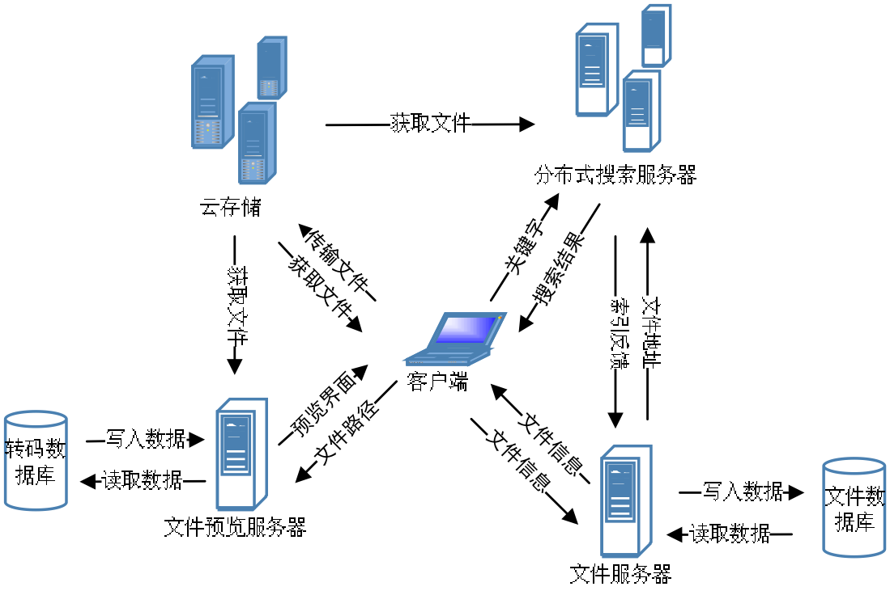
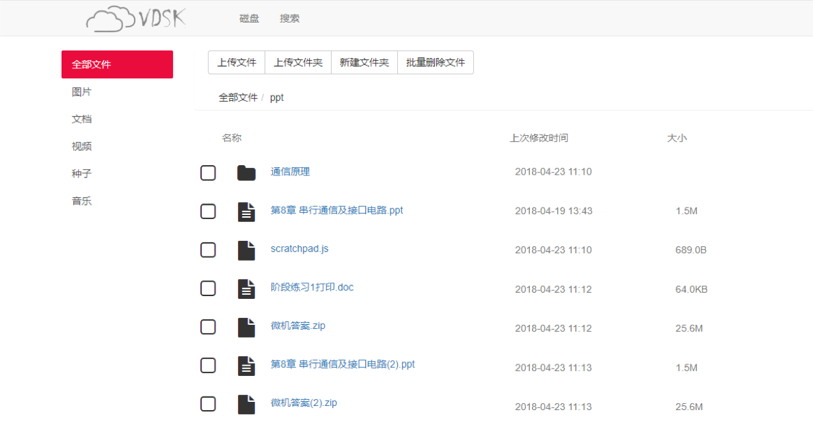
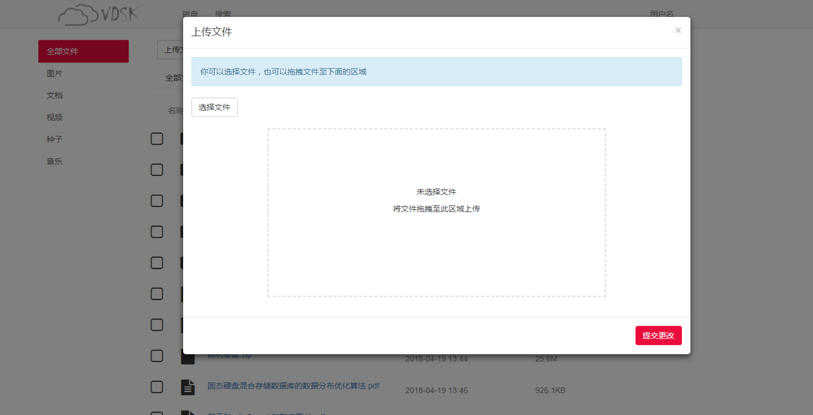
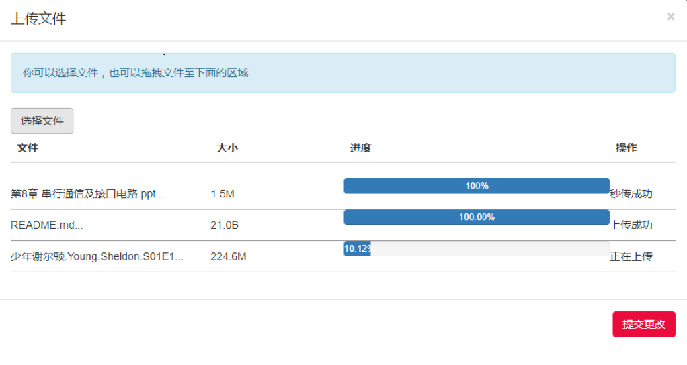
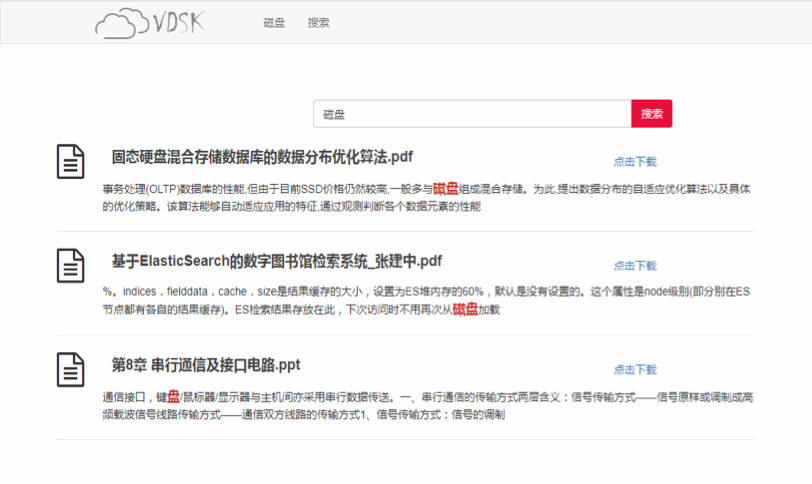

# VDSK-基于腾讯云的自建存储系统

### 基本功能

- 登录，注册等身份校验

- 上传，删除，重命名文件，支持秒传功能（前端校验MD5值）
- 支持在线预览，解压缩
- 基于ElasticSearch实现全文检索功能

### 整体架构

如图所示，所有的数据最终都会落到腾讯云的对象存储中，本地文件服务器会保存文件到用户的映射，分布式搜索服务会通过云存储下载文件，建立索引，文件预览模块也会从云存储中拉取文件，转码后提供预览服务

### 界面截图

##### 主界面

支持上传，批量删除，以及创建文件夹，文件根据后缀名进行分类，文件名点击之后可以在线预览

##### 上传

支持拖拽和选择的方式上传文件，上传的文件先通过UIUD改名后存储在腾讯COS对象存储上，在数据库中维护当前名字和改名之间的映射

上传支持秒传，通过校验MD5判断文件是否一致，如果相同文件则只需要添加一条记录

##### 搜索

通过ElasticSearch建立索引，支持文本的全文检索

#### 在线预览

这里使用了大神实现的在线预览模块[参考链接](https://github.com/kekingcn/kkFileView)

### 技术路线

数据库：MySQL

后端：node.js Express框架

前端：JQuery, bootstarp